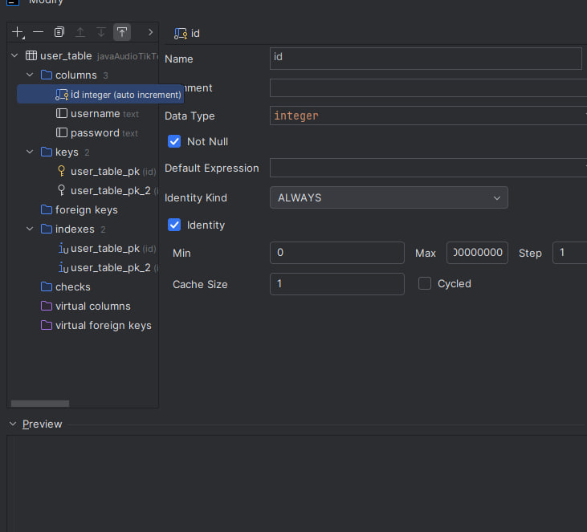

## Bootstrap Веб-Сервер

Это пример простейшего веб-сервера на Java+Spring+Bootstrap.


Чтобы его запустить, необходимо поменять файл настроек
`application-prod.properties` в папке `resources`

В основном файле настроек указывается только название сборки, в нашем
случае - `prod`. Компилятор подружает файл настроект с 
соответствующим постфиксом.


логин и пароль
- u1/q1
- u2/q2
- u3/q3


Общий вид параметров по данным базы

```
spring.datasource.url=jdbc:postgresql://Host:Port/Database
spring.datasource.username=User
spring.datasource.password=Password
spring.datasource.driverClassName=org.postgresql.Driver
```

Например, если данные базы такие:

<table>
  <tr>
    <td>Host</td>  
    <td>test1.compute.amazonaws.com</td>
  </tr>
  <tr>
    <td>Port</td>
<td>5432</td>
  </tr>
  <tr>
    <td>Database</td>  
   <td>dbexqe3d</td>
  </tr>
  <tr>
    <td>User</td>
  <td>bocxxsadfar</td>
  </tr>
  <tr>
    <td>Password</td>
    <td>b12dd116c55986ce49bad37a40605f8833c38f9e0f28</td>
  </tr>
  <tr>  
</tr>
</table>

То файл параметров программы будет таким:


```
spring.datasource.url=jdbc:postgresql://test1.compute.amazonaws.com:5432/dbexqe3d
spring.datasource.username=bocxxsadfar
spring.datasource.password=b12dd116c55986ce49bad37a40605f8833c38f9e0f28
spring.datasource.driverClassName=org.postgresql.Driver
```

### Idea

В новой версии Idea, если создавать таблицы вручную, то для поля `id`
нужно задать следующие параметры



Также колонку `id` нужно сделать `primary key` и `unique key`


### Бекап


Для восстановления из базы данных из бекапа нужно использовать
файл `dump.backup` или файл `dump.sql`.

Первый файл - это сцеиализированный файл `postgres`. Из него точно 
можно восстановить данные. Второй - `dump.sql`, сделал на всякий случай


